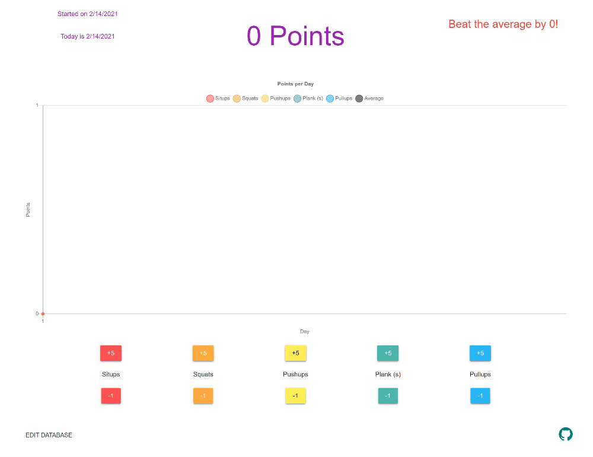

# workout.ihtfy.com

You can use this page to track calisthenics each day. The page automatically knows the date, so all you need to do is punch in your reps as you complete them.

The included excercises are:

- Situps
- Squats
- Pushups
- Planks
- Pullups

> Data is stored in your browser's `window.localStorage`, so it will persist across refreshes and restarting your computer. It does NOT sync across devices.

--- 

## Day 1

The graph will look pretty bare on your first day. You can notice the first data points on the far left as you input some values.

---

## Day 2

When you check in the next day, you'll start to see how things are trending. Try to beat your overall average: check the red text in the top right.

---

## Eventually

Don't worry if you miss some days, just try to beat the average!

---

## Show/Hide Lines

Click on the legend items to show and hide the corresponding lines.

> Note: The average line doesn't adjust when the y-axis scale changes

---

## Edit the data

If you forgot to enter some data, you can edit it directly using the `EDIT DATABASE` button at the bottom.

> WARNING: You may want to copy the current data before editing, since a malformatted JSON may corrupt your data.

